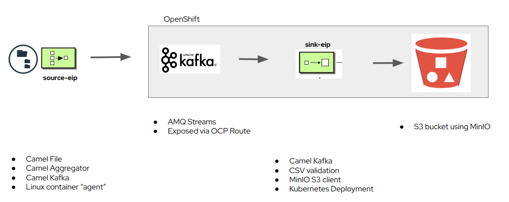

:scrollbar:
:data-uri:
:toc2:
:linkattrs:

= Machine Learning Data Streamer 

:numbered:

== Architecture

== Pre-Reqs

. Set environment variables:
+
-----
export project_name=user1-ml-data-streamer
export kafka_route_host=$(oc get route kafka-cluster-kafka-bootstrap -n $project_name --template='{{ .spec.host }}') \
    && export kafka_node_port=443 \
    && export ts_path=/tmp/kafka_broker.pkcs12 \
    && export ts_pass=password
-----

. Clone this project and change directories into it:
+
-----
$ git clone https://github.com/redhat-na-ssa/ml_data_streamer \
    && cd ml_data_streamer
-----

== source-eip

=== Development

. Change directories into `source-eip`:
+
-----
$ cd source-eip
-----

. Optional: Start as quarkus runnable jar:
+
-----
$ java  \
    -Dkafka.bootstrap.servers=rht:32009 \
    -Dcom.rht.na.gtm.source.location=/tmp/com_rht_na_gtm_source/ \
    -Dcom.rht.na.gtm.topic.name=csv-financials \
    -jar source-eip/target/quarkus-app/quarkus-run.jar
-----

. Build and push source-eip container to quay:
+
-----
$ ./mvnw clean package \
            -DskipTests \
            -Dquarkus.application.name=ml_data_streamer-source-eip \
            -Dquarkus.container-image.build=true \
            -Dquarkus.container-image.push=true
-----

=== Camel Kafka client security

. Obtain Certificate of AMQ Streams `kafka-cluster-kafka-bootstrap` route:
+
-----
$ oc get secret kafka-cluster-cluster-ca-cert \
        -n $project_name -o jsonpath='{.data.ca\.crt}' \
        | base64 -d > /tmp/kafka_broker.crt
-----

. Optional: Inspect certificate:
+
-----
$ step certificate inspect /tmp/kafka_broker.crt --bundle | grep -A1 'Subject:'
-----

. Create a truststore from the kafka-broker certificate:
+
-----
$ keytool \
    -import \
    -file /tmp/kafka_broker.crt \
    -alias kafka-cluster-kafka \
    -keystore $ts_path \
    -storepass $ts_pass \
    -storetype PKCS12 \
    -trustcacerts
-----

. Optional: Check contents of truststore:
+
-----
$ keytool \
    -list -rfc \
    -storepass $ts_pass \
    -keystore $ts_path
-----

. Optional:  If the `kafka-console-producer.sh` utility is avialable locally, test connection to broker by sending messages:
+
-----
$ bin/kafka-console-producer.sh \
    --topic csv-financials \
    --producer.config=/tmp/kafka_broker.properties \
    --broker-list $kafka_route_host:443 \
    --producer-property security.protocol=SSL \
    --producer-property ssl.truststore.location=$ts_path \
    --producer-property ssl.truststore.password=$ts_pass
-----

=== Test 

==== Run Container as Root

. Create CSV directory:
+
-----

$ export csv_dir=/tmp/com_rht_na_gtm_source \
    && mkdir -p $csv_dir
-----

. Start `source-eip` app as linux-container:
+
-----

$ podman run  -it --rm \
    --publish 8080:8080 \
    --name source-eip \
    -e "JAVA_OPTS=-Dkafka.bootstrap.servers=$kafka_route_host:$kafka_node_port -Dcom.rht.na.gtm.source.location=$csv_dir -Dcamel.component.kafka.security-protocol=SSL -Dcamel.component.kafka.ssl-truststore-location=/tmp/kafka_broker.pkcs12 -Dcamel.component.kafka.ssl-truststore-password=password -Dcamel.component.kafka.ssl-truststore-type=PKCS12"  \
    -v $ts_path:$ts_path:Z \
    -v $csv_dir:$csv_dir:Z \
    -u root \
    quay.io/redhat_naps_da/ml_data_streamer-source-eip:0.0.1
-----

. Trigger source-eip service:
+
-----
$ cp source-eip/src/test/resources/samples/MUFG-1.csv \
     source-eip/src/test/resources/samples/MUFG-2.csv \
     source-eip/src/test/resources/samples/MUFG-3.csv \
     $csv_dir
-----

== sink-eip

=== Development

. Build and push sink-eip container to quay:
+
-----
$ ./mvnw clean package \
            -DskipTests \
            -Dquarkus.application.name=ml-data-streamer-sink-eip \
            -Dquarkus.container-image.build=true \
            -Dquarkus.container-image.push=true
-----

=== Deployment

. create new namespace where `sink-eip` service will run:
+
-----
$ oc new-project $project_name
-----

. Deploy `sink-eip` service:
+
-----
$ oc apply \
    -k config_mgmt/gitops-dev/bootstrap/deploy/ml-data-streamer-sink-eip/
    -n $project_name
-----

== Kafka

=== Deployment

. Create topic:
+
-----
$ export topic_name=csv-financials
$ echo "kind: KafkaTopic
apiVersion: kafka.strimzi.io/v1beta2
metadata:
  name: $topic_name
  labels:
    strimzi.io/cluster: $topic_name
spec:
  partitions: 10
  replicas: 3
  config:
    retention.ms: 604800000
    segment.bytes: 1073741824" \
| oc apply -n $project_name -f -

-----

== Appendix

==== Optional: Run `source-eip` container as Rootless

. Start `source-eip` app as linux-container:
+
-----

$ export csv_dir=/tmp/com_rht_na_gtm_source
$ mkdir -p $csv_dir \
    && sudo chmod -R 775 $csv_dir \
    && sudo semanage fcontext -a \
        -t container_file_t "$csv_dir(/.*)?" \
    && sudo restorecon -R $csv_dir
$ podman unshare chown 185:$(id -g) -R $csv_dir
$ podman unshare ls -al $csv_dir

$ podman run  -it --rm \
        --publish 8080:8080 \
        --name source-eip \
        -e "JAVA_OPTS=-Dkafka.bootstrap.servers=$kafka_route_host:$kafka_node_port -Dcom.rht.na.gtm.source.location=$csv_dir" \
        -v $csv_dir:$csv_dir:Z \
        --group-add keep-groups \
        quay.io/redhat_naps_da/ml_data_streamer-source-eip:0.0.1
-----

. Trigger source-eip service:
+
-----
$ podman unshare cp \
    source-eip/src/test/resources/samples/MUFG-1.csv \
    source-eip/src/test/resources/samples/MUFG-2.csv \
    source-eip/src/test/resources/samples/MUFG-3.csv \
    $csv_dir
-----

